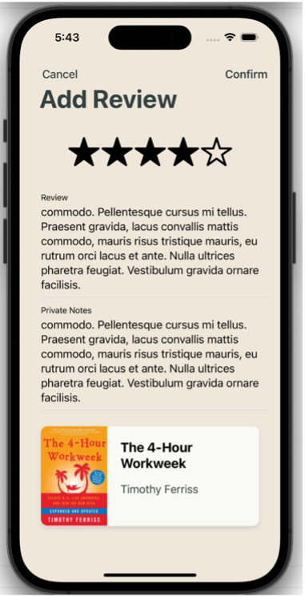
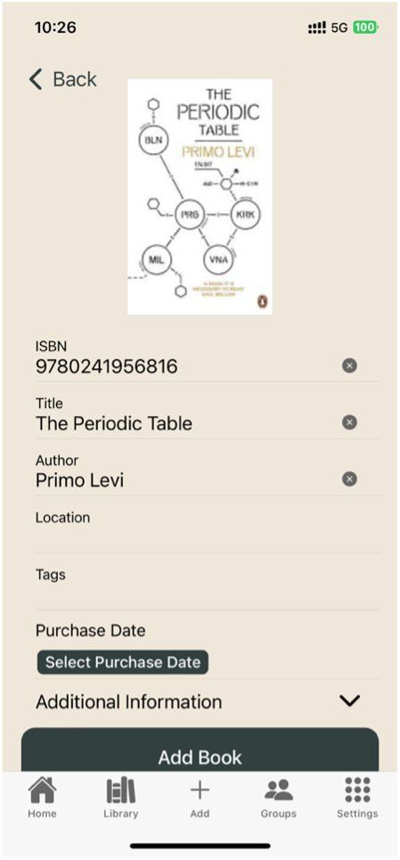

# LibraryVault - Home Library Management App

**LibraryVault** is a mobile application designed to streamline the management of personal book collections. It allows users to catalogue, organize, review, and track their books, while also providing social features such as group libraries and loan tracking. With a focus on user-centric design, this app offers a seamless experience for book lovers who want to manage their library and share it with others.

---

## Project Overview

LibraryVault enables users to:
- Track and organize their book collections with flexibility in sorting by location, genre, or custom tags.
- Record private notes and book reviews for each book.
- Create and manage book groups, allowing users to share and view collections collectively.
- Track loaned books and manage lending activities.
- Receive personalized book recommendations, with the ability to add books to a wish list for future borrowing or purchasing.

The app is built using a cross-platform mobile development stack, ensuring seamless performance on both iOS and Android devices.

---

## Key Features

- **Book Collection Management**: Easily track and organize your book collection.
  - Sort books by location, genre, and custom tags.
  - Add private notes and book reviews.

- **Group Libraries**: Create shared libraries where multiple users can view and contribute to a collective collection.

- **Loan Tracking**: Efficiently manage books you’ve loaned to others, with status updates and due dates.

- **Personalized Recommendations**: Receive generic book recommendations based on your collection and preferences.

- **Wish List**: Maintain a list of books you'd like to borrow or purchase in the future.

---

## Project Objectives

The primary objectives of the project were:
1. **Efficient and Usable Tool**: Develop an easy-to-use, intuitive app that allows users to manage their books seamlessly.
2. **User-Centric Design**: Conduct user research and gather iterative feedback to ensure the app meets the needs and preferences of its users.
3. **Learning and Applying New Technologies**: Utilize modern technologies like React, Ionic, Capacitor, and Firebase for cross-platform development and cloud integration.
4. **Effective Time Management**: Adhere to a strict project timeline, ensuring all phases (research, design, implementation, testing, deployment) were completed on schedule.
5. **Quality and Performance**: Deliver a stable, high-performing app with a strong foundation, backed by rigorous testing and continuous iteration based on user feedback.

---

## Technologies Used

- **React**: JavaScript library for building the app's user interface.
- **Ionic Framework**: Framework for building cross-platform mobile applications using web technologies (HTML, CSS, JavaScript).
- **Capacitor**: Native runtime for building native mobile apps with web technologies.
- **Firebase**: Cloud platform for real-time database, authentication, and deployment.

---

## Development Process

The development of LibraryVault involved end-to-end full-stack development. Key steps included:

1. **Research and Planning**: Defined project scope, user personas, and app features based on user needs and feedback.
2. **UI/UX Design**: Focused on creating an intuitive interface with easy navigation.
3. **Implementation**: Built the app using React and Ionic, integrating Firebase for backend functionality.
4. **Testing and Iteration**: Conducted usability testing and refined the app based on user feedback to ensure a smooth experience.
5. **Deployment**: Deployed the app on both iOS and Android platforms, ensuring compatibility and optimal performance.

---
## Use Cases

### USE CASE 1: CATALOGUE/ADD A BOOK TO LIBRARY
**The user wants to catalogue/add a book to their library collection.**

The **Cataloguing and Data Entry** feature is a core functionality of the app that simplifies the process of adding books to the library. It offers three methods for cataloguing:

1. **Manual Entry**: Users can manually enter book details by filling in all required fields.
2. **ISBN Recognition**: Users can scan the barcode using their device's camera or manually enter the ISBN to auto-fill book details.
3. **Search and Add**: Users can search for a book by title, author, or ISBN, and add it to their collection.

The system is integrated with a book database, enhancing accuracy and efficiency. When the ISBN is scanned or entered, relevant book information is automatically populated from the database, making cataloguing quick and convenient.

---

### USE CASE 2: ORGANISE AND MANAGE BOOKS
**The user wants to organise and manage the books in their library.**

The **Library Organisation and Management** feature allows users to easily categorize their books by:
- **Location**
- **Tags**
- **Genre**

This helps users quickly locate any book in their collection, making it easier to organize and maintain a comprehensive library.

---

### USE CASE 3: TRACK A BOOK
**The user wants to track a book.**

The **Loan Tracking** feature allows users to keep a record of books they've loaned out. Users can:
- Set start and end dates for loaned books.
- View the current loans for a book.
- Check a summary of all loans, including the number of active loans.

While the initial scope included both loan and borrow tracking, the **borrow tracking** feature was removed due to time constraints.

---

### USE CASE 4: RECOMMEND A BOOK
**The user wants book recommendations.**

The **Recommendation** feature offers generic, random book suggestions. However, due to the random nature of the recommendations, including affiliate links was not feasible. The Google Books API, which powers the recommendations, does not provide the necessary direct links for affiliate integration.

As a result, the ability to include affiliate links was removed from the project scope.

---

### USE CASE 5: WRITE A REVIEW
**The user wants to write a review.**

The **Reviews and Ratings** feature allows users to:
- Write detailed reviews for books.
- Assign star ratings.
- Share these reviews within user groups, making them accessible to others within the same group.

This enhances the community aspect, allowing users to discover books based on group recommendations.

---

### USE CASE 6: CREATE AN ACCOUNT
**The user wants to create an account.**

The **Account Management** feature allows users to create and manage their accounts easily. Key functionalities include:
- Creating private notes about books for personal use.
- Sharing reviews within user groups.

To streamline development, the user registration process was limited to **email and password** only. Third-party authentication methods (e.g., Apple, Google) were removed from the scope to allocate more time to other critical features.

---

### USE CASE 7: MANAGE ACCOUNT
**The user wants to add a person to their library.**

The **User Group** feature lets users create and manage groups, enabling them to share their library with others. Key functionalities include:
- Adding individuals to the group.
- Sharing books, reviews, and recent additions.
- Collaborating with other users to organize and explore the shared library.

This feature is ideal for households or communities who want to share and manage their book collections collectively.

---

### USE CASE 8: ADD BOOKS TO A WISH LIST
**The user wants to add books they want to buy to a Wishlist.**

The **Wishlist** feature allows users to:
- Curate a list of books they want to purchase or borrow in the future.
- Add books from the recommendations to their wishlist, building a personalized list of desired titles.

This feature was moved from a secondary objective to a core objective because it enhances the overall user experience and complements the recommendations feature.

---

### USE CASE 9: VIEW BASIC ANALYTICS
**The user wants to view analytics about their library.**

The **Analytics** feature provides basic insights into the user's library, including:
- Total number of books in their collection.
- Number of user groups they are part of.
- Number of books in their wishlist.
- Number of books currently loaned out.

This feature was originally a secondary objective but was moved to a core objective to provide more valuable insights to the user.

---
## User Interface

### LOGIN PAGE
The **Login Page** is the first screen users see when opening the app. Here, they can log in using their email and password. If the user doesn't have an account, they can click the **bold register** text to be redirected to the registration page.

  

---

### REGISTER PAGE
On the **Register Page**, the user is presented with a form to create a new account. They must fill in the following details:
- **First Name**
- **Last Name**
- **Email**
- **Password**

If the user already has an account, they can click the **bold log in** text to be redirected to the login page. *(See Use Case 6)*

  

---

### HOME PAGE
The **Home Page** displays four boxes with library statistics that are clickable and redirect users to different sections of the app:

1. **Number of Owned Books**: Clicking redirects to the **Library Page**.
2. **Number of Groups**: Clicking redirects to the **Groups Page**.
3. **Number of Books Being Loaned Out**: Clicking redirects to the **Loan Tracking Page**.
4. **Number of Books in Wishlist**: Clicking redirects to the **Wishlist Page**. *(See Use Case 9)*

At the bottom, there are **random book recommendations**. Only book covers are displayed, but users can click them to be redirected to the **Book Information Page**. *(See Use Case 4)*

  

---

### WISHLIST PAGE
The **Wishlist Page** shows all books currently in the user's wishlist. Users can click on any book card to view more details. On the book details page, users can see:
- Average Rating
- Book Title
- Author
- Year Published
- Number of Pages
- Description
- A button to **remove the book from their wishlist**. *(See Use Case 8)*

  
  

---

### LOANING A BOOK
To **loan a book**, the user navigates to the book they want to loan out and selects the "Add Loan" option. They then fill in:
- The **name of the person** they're loaning the book to.
- **Start Date** and **End Date** for the loan.

The loan details are visible on the **Book Information Page** or **Loan Tracking Page** after confirming. *(See Use Case 3)*

  
  
  

---

### LOAN TRACKING PAGE
The **Loan Tracking Page** displays all books that have been or are currently being loaned out. Clicking on a book takes the user to its **Book Information Page**. *(See Use Case 3)*

  

---

### BOOK RECOMMENDATIONS PAGE
The **Book Recommendations Page** shows random book recommendations. When users click on a book cover, they are redirected to the **Book Information Page**, where they can see:
- Average Rating
- Book Title
- Author
- Year Published
- Number of Pages
- Description
- A button to **add the book to their wishlist**. *(See Use Cases 4 & 8)*

  
  
  

---

### LIBRARY PAGE
The **Library Page** displays all books, both owned and shared with the user through groups. The user can:
1. **View only their own books** by selecting "My Books."
2. **View group books** by selecting a group.

There is a **search bar** at the top of the page, and next to it is an **icon** to open a filter. The user can filter books by:
- **Location**
- **Genres** (currently working)
- **Tags** (currently broken)
- A future feature will allow filtering books based on whether they are loaned out or not. *(See Use Cases 2 & 7)*

  
  
  

---

### BOOK INFORMATION PAGE

#### USER OWNS THE BOOK
When the user owns the book, they are shown:
- **Option to Edit Book Details**
- **Option to Edit Review**
- **Option to Add Loan**
- **Option to Delete the Book from Library**

*(See Use Case 5)*

  
  
  

#### USER DOES NOT OWN THE BOOK
If the user does not own the book but it is shared with them, they can view the book details but will not have options to:
- Edit details
- Add a loan
- Delete the book

However, they may be able to **add a review and rating**, but only the owner can manage the book. *(See Use Case 7)*

  

---

### ADDING REVIEW AND RATING TO A BOOK IN LIBRARY
When the user selects a book from their library, they can choose to **add a review, rating, and private notes** by clicking on the "Review Book" button. They can:
- Rate the book from **0 to 5 stars**.
- Add a **review** and **private notes**.

After submission, the **Book Information Page** will display the rating, review, and private notes. Only the owner can view their private notes. *(See Use Case 5)*

  
  
  

---

### ADDING A BOOK TO LIBRARY OPTIONS

  

When the user clicks the **Add** button in the toolbar, they are presented with three options to add a book:
1. **Manually Insert**: Users fill in book details such as ISBN, title, author, purchase date, location, and tags. They can also add additional information like description, genre, pages, etc.

  
  

2. **Search Option**: Users can search for a book by title, author, or ISBN. After selecting a book, they are redirected to the "Manually Insert" page, where most of the fields are populated by the API. The user only fills in location, purchase date, and tags.

  
  
  

3. **Barcode Scanner Option**: Similar to the search option, but users scan the barcode instead of typing in the information. The API populates the details, and the user fills in missing information. *(See Use Case 1)*

  
  
  

---

### GROUPS PAGE
The **Groups Page** renders differently based on the user's group membership:

#### USER IN MORE THAN ONE GROUP
- Users can select a group at the top of the page.
- They can view the most recent review by a group member.
- The page displays **recently added books** by group members.
- Users can leave a group, create a new group, or add new members.

  
  

#### USER IN ONE GROUP
- Displays the group name at the top.
- The rest of the page is the same as the multi-group view.

  

#### USER IN NO GROUP
- Users can create a new group, but **joining a group** is not currently possible. This feature is planned for future releases.

  

---

### ADD A NEW MEMBER TO A GROUP
To **add a member** to a group:
- In the group page, select the **add person** icon.
- Search for the user's email and add them to the group.

  
  
  

---

### LEAVE A GROUP
To **leave a group**, users can click on the option to leave, and they will be prompted with a confirmation message.

  

---

### SETTINGS PAGE
The **Settings Page** contains sections for:
- **Account Information**
- **Privacy and Security**
- **Help and Support**
- **About Pages**

Currently, these sections contain placeholder information. Users can also **log out** from this page.

  

---

